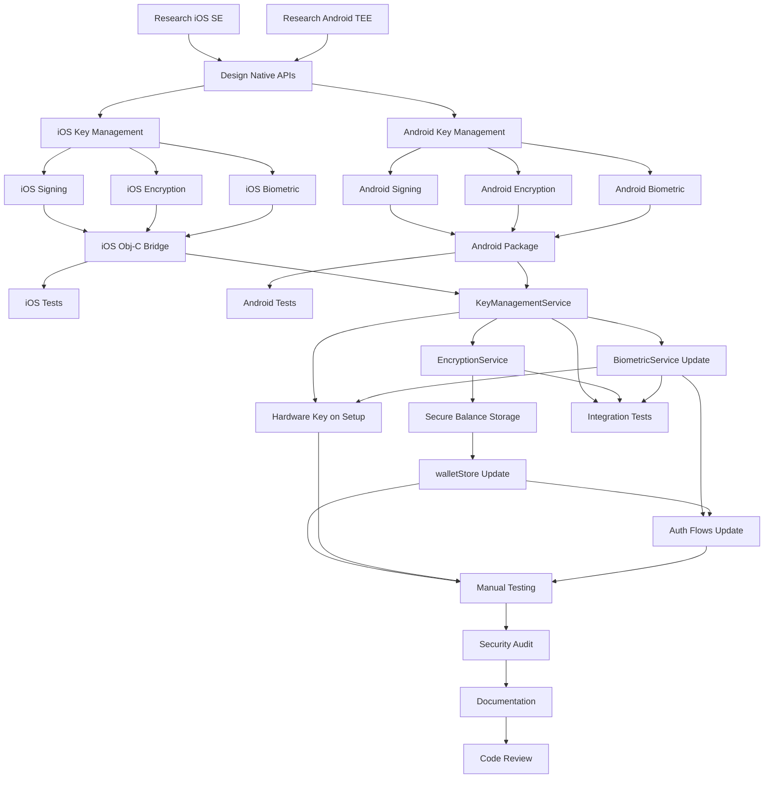

# Phase 4: Hardware Security Integration - Task Assignments

**Generated**: October 31, 2025
**Version**: 1.0
**Total Tasks**: 27
**Total Effort**: 100 hours
**Duration**: 2.5 weeks

---

## Table of Contents

1. [Task Assignment Overview](#task-assignment-overview)
2. [Research & Design Tasks](#research--design-tasks)
3. [iOS Native Module Tasks](#ios-native-module-tasks)
4. [Android Native Module Tasks](#android-native-module-tasks)
5. [TypeScript Integration Tasks](#typescript-integration-tasks)
6. [Testing & Validation Tasks](#testing--validation-tasks)
7. [Documentation Tasks](#documentation-tasks)
8. [Dependency Graph](#dependency-graph)
9. [Critical Path Analysis](#critical-path-analysis)

---

## Task Assignment Overview

### Task Distribution by Type

| Category | Tasks | Effort | Sub-Agent |
|----------|-------|--------|-----------|
| Research & Design | 3 | 12h | Tech Lead |
| iOS Native Development | 6 | 34h | iOS Native Dev |
| Android Native Development | 6 | 34h | Android Native Dev |
| TypeScript Integration | 7 | 31h | Frontend Dev |
| Testing | 4 | 23h | QA / All Devs |
| Documentation | 1 | 4h | Tech Writer |
| **Total** | **27** | **100h** | - |

### Task Status Legend

- **To Do**: Ready to start (all dependencies met)
- **In Progress**: Currently being worked on
- **Blocked**: Waiting on dependencies
- **Completed**: Finished and validated

---

## Research & Design Tasks

### P4-T01: Research iOS Secure Enclave APIs and Best Practices

**Task ID**: P4-T01
**Assigned To**: Tech Lead
**Type**: Research
**Effort**: 4 hours
**Dependencies**: None
**Priority**: P0 (Critical)
**Status**: To Do

**Description**:
Research and document iOS Secure Enclave APIs, CryptoKit framework, and best practices for hardware-backed key management. This research will inform the iOS native module implementation.

**Research Areas**:
1. Secure Enclave architecture and capabilities
2. Key generation with `SecKeyCreateRandomKey`
3. Access control with `SecAccessControlCreateWithFlags`
4. Biometric binding with `LAContext`
5. Signing and encryption APIs
6. Error handling and edge cases
7. Performance characteristics
8. Device compatibility (iPhone 5S+)

**Deliverables**:
- Research document with API examples
- Code snippets for key operations
- Performance benchmarks from Apple documentation
- Device compatibility matrix
- Security best practices checklist

**Acceptance Criteria**:
- [ ] Documented Secure Enclave API for key generation
- [ ] Documented signing process with biometric requirement
- [ ] Documented encryption/decryption approach (ECIES or AES-GCM)
- [ ] Identified error scenarios and handling
- [ ] Listed device compatibility requirements
- [ ] Created reference implementation pseudocode

**Files to Create**:
- `/docs/research/ios-secure-enclave-research.md`

**Resources**:
- [Apple Secure Enclave Documentation](https://developer.apple.com/documentation/security/certificate_key_and_trust_services/keys/protecting_keys_with_the_secure_enclave)
- [CryptoKit Framework](https://developer.apple.com/documentation/cryptokit)
- [Local Authentication](https://developer.apple.com/documentation/localauthentication)

---

### P4-T02: Research Android Keystore/TEE APIs and Best Practices

**Task ID**: P4-T02
**Assigned To**: Tech Lead
**Type**: Research
**Effort**: 4 hours
**Dependencies**: None
**Priority**: P0 (Critical)
**Status**: To Do

**Description**:
Research and document Android Keystore system, TEE integration, and hardware-backed security. This research will inform the Android native module implementation.

**Research Areas**:
1. Android Keystore architecture
2. TEE (Trusted Execution Environment) integration
3. StrongBox hardware security module (Android 9+)
4. Key generation with `KeyGenParameterSpec`
5. Biometric authentication with `BiometricPrompt`
6. `setUserAuthenticationRequired` for biometric binding
7. Signing, encryption, and decryption APIs
8. Error handling and fallback strategies
9. Performance characteristics
10. Device compatibility matrix

**Deliverables**:
- Research document with API examples
- Kotlin code snippets for key operations
- Performance benchmarks
- Device compatibility matrix (API 28+)
- Security best practices checklist

**Acceptance Criteria**:
- [ ] Documented Keystore API for key generation
- [ ] Documented TEE vs StrongBox differences
- [ ] Documented signing process with biometric requirement
- [ ] Documented encryption/decryption with AES-GCM
- [ ] Identified error scenarios and handling
- [ ] Listed device compatibility requirements
- [ ] Created reference implementation pseudocode

**Files to Create**:
- `/docs/research/android-keystore-tee-research.md`

**Resources**:
- [Android Keystore System](https://developer.android.com/training/articles/keystore)
- [Hardware-backed Keystore](https://source.android.com/security/keystore)
- [BiometricPrompt API](https://developer.android.com/reference/androidx/biometric/BiometricPrompt)

---

### P4-T03: Design Native Module Interfaces (Key Management, Signing, Encryption)

**Task ID**: P4-T03
**Assigned To**: Tech Lead
**Type**: Design
**Effort**: 4 hours
**Dependencies**: P4-T01, P4-T02
**Priority**: P0 (Critical)
**Status**: To Do

**Description**:
Design unified native module interfaces for both iOS and Android that provide consistent API for key management, signing, and encryption operations. This design must work seamlessly with React Native bridge.

**Design Requirements**:
1. Consistent API across iOS and Android
2. Promise-based async operations
3. Descriptive error codes and messages
4. Support for multiple key types (signing, encryption)
5. Biometric requirement parameter
6. Hardware capability detection

**API Methods to Design**:
```typescript
// Key Management
generateKey(keyAlias: string, withBiometric: boolean): Promise<KeyGenerationResult>
keyExists(keyAlias: string): Promise<boolean>
deleteKey(keyAlias: string): Promise<boolean>
getCapabilities(): Promise<HardwareCapabilities>

// Signing
sign(keyAlias: string, payload: string): Promise<SignatureResult>

// Encryption
encrypt(keyAlias: string, plaintext: string): Promise<EncryptedData>
decrypt(keyAlias: string, ciphertext: string, iv: string, authTag: string): Promise<string>
```

**Deliverables**:
- API specification document
- TypeScript interface definitions
- Platform-specific implementation notes
- Error code definitions
- Performance requirements per method

**Acceptance Criteria**:
- [ ] API specification document complete
- [ ] All method signatures defined
- [ ] Error codes documented
- [ ] iOS implementation notes written
- [ ] Android implementation notes written
- [ ] Performance requirements specified
- [ ] TypeScript interfaces created

**Files to Create**:
- `/docs/design/native-module-api-spec.md`
- `/src/types/nativeModules.ts`

---

## iOS Native Module Tasks

### P4-T04: iOS SMVCSecurityModule (Swift) - Key Management

**Task ID**: P4-T04
**Assigned To**: iOS Native Dev
**Type**: iOS Native Development
**Effort**: 8 hours
**Dependencies**: P4-T03
**Priority**: P0 (Critical)
**Status**: To Do

**Description**:
Implement iOS native module for key management operations using Secure Enclave. This includes key generation, existence checks, deletion, and capability detection.

**Implementation Details**:

**Files to Create**:
- `/ios/OfflinePaymentPOC/SMVCSecurityModule.swift` (main implementation)
- `/ios/OfflinePaymentPOC/SecureEnclaveHelper.swift` (utility functions)

**Methods to Implement**:
1. `generateKey(_ keyAlias: String, withBiometric: Bool, resolver: RCTPromiseResolveBlock, rejecter: RCTPromiseRejectBlock)`
   - Check if key exists
   - Create access control with biometric requirement
   - Configure key attributes for Secure Enclave
   - Generate ECDSA P-256 key pair
   - Extract and export public key
   - Return result with public key

2. `keyExists(_ keyAlias: String, resolver: RCTPromiseResolveBlock, rejecter: RCTPromiseRejectBlock)`
   - Query keychain for key
   - Return boolean result

3. `deleteKey(_ keyAlias: String, resolver: RCTPromiseResolveBlock, rejecter: RCTPromiseRejectBlock)`
   - Delete key from keychain
   - Handle not found gracefully

4. `getCapabilities(_ resolve: RCTPromiseResolveBlock, rejecter: RCTPromiseRejectBlock)`
   - Check Secure Enclave availability
   - Check biometric availability
   - Return capability object

**Key Configuration**:
```swift
let keyAttributes: [String: Any] = [
    kSecAttrKeyType as String: kSecAttrKeyTypeECSECPrimeRandom,
    kSecAttrKeySizeInBits as String: 256,
    kSecAttrTokenID as String: kSecAttrTokenIDSecureEnclave,
    kSecPrivateKeyAttrs as String: [
        kSecAttrIsPermanent as String: true,
        kSecAttrApplicationTag as String: keyAlias.data(using: .utf8)!,
        kSecAttrAccessControl as String: accessControl
    ]
]
```

**Error Handling**:
- Key generation failure → Reject with "KEY_GENERATION_ERROR"
- Public key extraction failure → Reject with descriptive error
- Keychain query failure → Return false for keyExists
- Access control creation failure → Reject with error

**Testing**:
- Unit test key generation
- Test key existence check
- Test key deletion
- Test Secure Enclave capability detection
- Test error scenarios

**Acceptance Criteria**:
- [ ] Key generated in Secure Enclave successfully
- [ ] Public key extracted and returned as Base64
- [ ] Key marked as non-exportable
- [ ] Biometric requirement enforced
- [ ] keyExists returns correct boolean
- [ ] deleteKey removes key successfully
- [ ] getCapabilities returns correct hardware info
- [ ] All error scenarios handled
- [ ] Code compiles without warnings
- [ ] No memory leaks

---

### P4-T05: iOS SMVCSecurityModule (Swift) - Signing

**Task ID**: P4-T05
**Assigned To**: iOS Native Dev
**Type**: iOS Native Development
**Effort**: 6 hours
**Dependencies**: P4-T04
**Priority**: P0 (Critical)
**Status**: To Do

**Description**:
Implement transaction signing using Secure Enclave private key with ECDSA-SHA256. Signing requires biometric authentication.

**Implementation Details**:

**Files to Modify**:
- `/ios/OfflinePaymentPOC/SMVCSecurityModule.swift`

**Method to Implement**:
```swift
@objc func sign(
    _ keyAlias: String,
    payload: String,
    resolver: @escaping RCTPromiseResolveBlock,
    rejecter: @escaping RCTPromiseRejectBlock
)
```

**Implementation Steps**:
1. Retrieve private key from keychain (triggers biometric prompt)
2. Hash payload using SHA-256
3. Sign hash with private key using ECDSA
4. Return Base64-encoded signature

**Signing Algorithm**:
- Algorithm: `ecdsaSignatureMessageX962SHA256`
- Key Type: ECDSA P-256
- Output: DER-encoded signature (Base64)

**Error Handling**:
- Key not found → Reject with "KEY_NOT_FOUND"
- Invalid payload → Reject with "INVALID_PAYLOAD"
- Signing failure → Reject with "SIGNING_ERROR"
- User cancelled biometric → Reject with "USER_CANCELLED"

**Testing**:
- Test signing with valid key
- Test signature format (Base64)
- Test biometric prompt appears
- Test user cancellation
- Test invalid key alias
- Verify signature with public key

**Acceptance Criteria**:
- [ ] Signing method implemented
- [ ] Biometric prompt appears before signing
- [ ] Signature generated in Secure Enclave
- [ ] Signature returned as Base64 string
- [ ] Error scenarios handled correctly
- [ ] Signature verifiable with public key
- [ ] User cancellation handled gracefully
- [ ] Code compiles without warnings

---

### P4-T06: iOS SMVCSecurityModule (Swift) - Encryption

**Task ID**: P4-T06
**Assigned To**: iOS Native Dev
**Type**: iOS Native Development
**Effort**: 6 hours
**Dependencies**: P4-T04
**Priority**: P0 (Critical)
**Status**: To Do

**Description**:
Implement hybrid encryption using AES-GCM for data encryption and ECIES for key wrapping. This provides efficient encryption with Secure Enclave protection.

**Implementation Details**:

**Files to Modify**:
- `/ios/OfflinePaymentPOC/SMVCSecurityModule.swift`

**Methods to Implement**:

1. **encrypt**:
```swift
@objc func encrypt(
    _ keyAlias: String,
    plaintext: String,
    resolver: @escaping RCTPromiseResolveBlock,
    rejecter: @escaping RCTPromiseRejectBlock
)
```

**Encryption Process**:
1. Generate random 256-bit AES key
2. Encrypt plaintext with AES-GCM
3. Extract ciphertext, IV, and authentication tag
4. Wrap AES key with Secure Enclave public key (ECIES)
5. Return all components as Base64

2. **decrypt**:
```swift
@objc func decrypt(
    _ keyAlias: String,
    ciphertext: String,
    iv: String,
    authTag: String,
    wrappedKey: String,
    resolver: @escaping RCTPromiseResolveBlock,
    rejecter: @escaping RCTPromiseRejectBlock
)
```

**Decryption Process**:
1. Unwrap AES key using Secure Enclave private key (triggers biometric)
2. Reconstruct AES-GCM sealed box
3. Decrypt ciphertext with unwrapped AES key
4. Verify authentication tag
5. Return plaintext

**Security Features**:
- Random IV per encryption
- GCM authentication tag for tamper detection
- AES key wrapped by Secure Enclave key
- Biometric required for decryption

**Error Handling**:
- Encryption failure → Reject with "ENCRYPTION_ERROR"
- Decryption failure → Reject with "DECRYPTION_ERROR"
- Authentication tag mismatch → Reject with "TAMPER_DETECTED"
- Invalid input → Reject with "INVALID_INPUT"

**Testing**:
- Test encryption with valid data
- Test decryption returns original plaintext
- Test tampered ciphertext fails authentication
- Test biometric prompt on decryption
- Test round-trip encryption/decryption

**Acceptance Criteria**:
- [ ] Encryption method implemented
- [ ] Decryption method implemented
- [ ] AES-GCM used for data encryption
- [ ] ECIES used for key wrapping
- [ ] Random IV generated per encryption
- [ ] Authentication tag verified on decryption
- [ ] Biometric required for decryption
- [ ] Tampered data detected and rejected
- [ ] Round-trip test passes
- [ ] Code compiles without warnings

---

### P4-T07: iOS SMVCSecurityModule (Swift) - Biometric Integration

**Task ID**: P4-T07
**Assigned To**: iOS Native Dev
**Type**: iOS Native Development
**Effort**: 6 hours
**Dependencies**: P4-T04, P4-T05, P4-T06
**Priority**: P0 (Critical)
**Status**: To Do

**Description**:
Integrate Local Authentication framework to ensure biometric verification is properly tied to Secure Enclave key operations. Add helper methods for biometric checks.

**Implementation Details**:

**Files to Modify**:
- `/ios/OfflinePaymentPOC/SMVCSecurityModule.swift`
- `/ios/OfflinePaymentPOC/SecureEnclaveHelper.swift`

**Methods to Add**:

1. **getBiometricKey** (helper for testing biometric access):
```swift
@objc func getBiometricKey(
    _ keyAlias: String,
    resolver: @escaping RCTPromiseResolveBlock,
    rejecter: @escaping RCTPromiseRejectBlock
)
```
- Attempt to access key (triggers biometric)
- Return success/failure
- Used by TypeScript to verify hardware key access

2. **checkBiometricEnrollment**:
```swift
@objc func checkBiometricEnrollment(
    _ resolve: @escaping RCTPromiseResolveBlock,
    rejecter reject: @escaping RCTPromiseRejectBlock
)
```
- Check if Face ID/Touch ID is enrolled
- Return enrollment status

**Access Control Configuration**:
```swift
let accessControl = SecAccessControlCreateWithFlags(
    kCFAllocatorDefault,
    kSecAttrAccessibleWhenUnlockedThisDeviceOnly,
    [.privateKeyUsage, .biometryCurrentSet],  // Key invalidated if biometry changes
    &error
)
```

**Biometric Types**:
- Face ID: `.face`
- Touch ID: `.touchID`
- None: `.none`

**Error Handling**:
- Biometric not available → Return error
- Biometric not enrolled → Return error
- User cancelled → Specific error code
- Biometric lockout → Specific error code

**Testing**:
- Test Face ID prompt appears
- Test Touch ID prompt appears
- Test user cancellation
- Test successful authentication
- Test lockout after failed attempts
- Test key invalidation on biometric change

**Acceptance Criteria**:
- [ ] Biometric prompt triggered by key access
- [ ] Face ID/Touch ID detected correctly
- [ ] Enrollment status checked correctly
- [ ] User cancellation handled
- [ ] Lockout scenarios handled
- [ ] Key invalidated on biometric change
- [ ] getBiometricKey method working
- [ ] Error messages user-friendly
- [ ] Code compiles without warnings

---

### P4-T08: iOS Objective-C Bridge for SMVCSecurityModule

**Task ID**: P4-T08
**Assigned To**: iOS Native Dev
**Type**: iOS Native Development
**Effort**: 4 hours
**Dependencies**: P4-T04, P4-T05, P4-T06, P4-T07
**Priority**: P0 (Critical)
**Status**: To Do

**Description**:
Create Objective-C bridge file to expose Swift native module to React Native. This allows JavaScript to call Swift methods through the React Native bridge.

**Implementation Details**:

**Files to Create**:
- `/ios/OfflinePaymentPOC/SMVCSecurityModule.m`

**Bridge Macros**:
```objc
#import <React/RCTBridgeModule.h>

@interface RCT_EXTERN_MODULE(SMVCSecurityModule, NSObject)

RCT_EXTERN_METHOD(generateKey:(NSString *)keyAlias
                  withBiometric:(BOOL)withBiometric
                  resolver:(RCTPromiseResolveBlock)resolve
                  rejecter:(RCTPromiseRejectBlock)reject)

RCT_EXTERN_METHOD(sign:(NSString *)keyAlias
                  payload:(NSString *)payload
                  resolver:(RCTPromiseResolveBlock)resolve
                  rejecter:(RCTPromiseRejectBlock)reject)

RCT_EXTERN_METHOD(encrypt:(NSString *)keyAlias
                  plaintext:(NSString *)plaintext
                  resolver:(RCTPromiseResolveBlock)resolve
                  rejecter:(RCTPromiseRejectBlock)reject)

RCT_EXTERN_METHOD(decrypt:(NSString *)keyAlias
                  ciphertext:(NSString *)ciphertext
                  iv:(NSString *)iv
                  authTag:(NSString *)authTag
                  wrappedKey:(NSString *)wrappedKey
                  resolver:(RCTPromiseResolveBlock)resolve
                  rejecter:(RCTPromiseRejectBlock)reject)

RCT_EXTERN_METHOD(keyExists:(NSString *)keyAlias
                  resolver:(RCTPromiseResolveBlock)resolve
                  rejecter:(RCTPromiseRejectBlock)reject)

RCT_EXTERN_METHOD(deleteKey:(NSString *)keyAlias
                  resolver:(RCTPromiseResolveBlock)resolve
                  rejecter:(RCTPromiseRejectBlock)reject)

RCT_EXTERN_METHOD(getCapabilities:(RCTPromiseResolveBlock)resolve
                  rejecter:(RCTPromiseRejectBlock)reject)

RCT_EXTERN_METHOD(getBiometricKey:(NSString *)keyAlias
                  resolver:(RCTPromiseResolveBlock)resolve
                  rejecter:(RCTPromiseRejectBlock)reject)

@end
```

**Swift Module Configuration**:
```swift
@objc static func requiresMainQueueSetup() -> Bool {
    return false  // Methods run on background thread
}
```

**Xcode Project Configuration**:
1. Add SMVCSecurityModule.swift to target
2. Add SMVCSecurityModule.m to target
3. Ensure bridging header configured
4. Add CryptoKit framework to "Link Binary With Libraries"
5. Add LocalAuthentication framework

**Testing**:
- Test module accessible from JavaScript
- Test all methods callable
- Test promise resolution/rejection
- Test method parameters pass correctly
- Test return values received in JavaScript

**Acceptance Criteria**:
- [ ] Objective-C bridge file created
- [ ] All Swift methods exposed to React Native
- [ ] Module registered correctly
- [ ] Methods callable from JavaScript
- [ ] Promise-based API working
- [ ] Xcode project configured correctly
- [ ] No build errors
- [ ] Module appears in NativeModules

---

### P4-T21: Write Native Module Tests (iOS XCTest)

**Task ID**: P4-T21
**Assigned To**: iOS Native Dev / QA
**Type**: Testing (iOS)
**Effort**: 6 hours
**Dependencies**: P4-T08
**Priority**: P0 (Critical)
**Status**: To Do

**Description**:
Write comprehensive XCTest suite for iOS native module to validate Secure Enclave integration, key operations, and error handling.

**Implementation Details**:

**Files to Create**:
- `/ios/OfflinePaymentPOCTests/SMVCSecurityModuleTests.swift`

**Test Cases**:

1. **Test Key Generation**:
```swift
func testKeyGeneration() {
    let expectation = self.expectation(description: "Key generation")

    module.generateKey("test_key", withBiometric: true) { result in
        XCTAssertTrue(result["success"] as! Bool)
        XCTAssertNotNil(result["publicKey"])
        expectation.fulfill()
    } rejecter: { code, message, error in
        XCTFail("Key generation failed: \(message ?? "")")
    }

    waitForExpectations(timeout: 5.0)
}
```

2. **Test Key Existence**:
```swift
func testKeyExists() {
    // First generate key
    // Then check existence
    // Assert true
}
```

3. **Test Signing**:
```swift
func testSigning() {
    // Generate key
    // Sign payload
    // Verify signature format
    // Verify signature with public key
}
```

4. **Test Encryption/Decryption**:
```swift
func testEncryptionDecryption() {
    // Generate key
    // Encrypt plaintext
    // Decrypt ciphertext
    // Assert plaintext matches
}
```

5. **Test Tamper Detection**:
```swift
func testTamperDetection() {
    // Encrypt data
    // Modify ciphertext
    // Attempt decryption
    // Assert failure with tamper error
}
```

6. **Test Key Deletion**:
```swift
func testKeyDeletion() {
    // Generate key
    // Verify exists
    // Delete key
    // Verify not exists
}
```

7. **Test Capabilities**:
```swift
func testGetCapabilities() {
    // Call getCapabilities
    // Verify hasSecureEnclave is true (on physical device)
    // Verify biometric availability
}
```

8. **Test Error Scenarios**:
```swift
func testSigningWithoutKey() {
    // Attempt to sign with non-existent key
    // Assert error
}
```

**Test Configuration**:
- Run on physical device (Secure Enclave unavailable in simulator)
- Mock biometric authentication in tests
- Clean up keys after each test

**Acceptance Criteria**:
- [ ] All test cases implemented
- [ ] Tests pass on physical device
- [ ] Key generation tested
- [ ] Signing tested and verified
- [ ] Encryption/decryption tested
- [ ] Tamper detection tested
- [ ] Error scenarios tested
- [ ] Code coverage > 80%
- [ ] No test failures

---

## Android Native Module Tasks

### P4-T09: Android SMVCSecurityModule (Kotlin) - Key Management

**Task ID**: P4-T09
**Assigned To**: Android Native Dev
**Type**: Android Native Development
**Effort**: 8 hours
**Dependencies**: P4-T03
**Priority**: P0 (Critical)
**Status**: To Do

**Description**:
Implement Android native module for key management using Keystore and TEE. Generate both EC keys (for signing) and AES keys (for encryption) with hardware backing.

**Implementation Details**:

**Files to Create**:
- `/android/app/src/main/java/com/offlinepaymentpoc/SMVCSecurityModule.kt`
- `/android/app/src/main/java/com/offlinepaymentpoc/KeystoreHelper.kt`

**Methods to Implement**:

1. **generateKey**:
```kotlin
@ReactMethod
fun generateKey(
    keyAlias: String,
    withBiometric: Boolean,
    promise: Promise
)
```

**Implementation**:
- Generate EC key pair for signing (ECDSA P-256)
- Generate AES key for encryption (AES-256-GCM)
- Use StrongBox if available (Android 9+)
- Set `setUserAuthenticationRequired(true)` for biometric
- Set `setInvalidatedByBiometricEnrollment(true)`
- Export public key as Base64

**Key Configuration (EC)**:
```kotlin
val keyPairGenerator = KeyPairGenerator.getInstance(
    KeyProperties.KEY_ALGORITHM_EC,
    "AndroidKeyStore"
)

val specBuilder = KeyGenParameterSpec.Builder(
    keyAlias,
    KeyProperties.PURPOSE_SIGN or KeyProperties.PURPOSE_VERIFY
)
    .setDigests(KeyProperties.DIGEST_SHA256)
    .setAlgorithmParameterSpec(ECGenParameterSpec("secp256r1"))
    .setUserAuthenticationRequired(withBiometric)
    .setInvalidatedByBiometricEnrollment(true)

if (Build.VERSION.SDK_INT >= Build.VERSION_CODES.P) {
    specBuilder.setIsStrongBoxBacked(true)
}
```

**Key Configuration (AES)**:
```kotlin
val keyGenerator = KeyGenerator.getInstance(
    KeyProperties.KEY_ALGORITHM_AES,
    "AndroidKeyStore"
)

val specBuilder = KeyGenParameterSpec.Builder(
    "${keyAlias}_aes",
    KeyProperties.PURPOSE_ENCRYPT or KeyProperties.PURPOSE_DECRYPT
)
    .setBlockModes(KeyProperties.BLOCK_MODE_GCM)
    .setEncryptionPaddings(KeyProperties.ENCRYPTION_PADDING_NONE)
    .setKeySize(256)
    .setUserAuthenticationRequired(withBiometric)
    .setInvalidatedByBiometricEnrollment(true)
```

2. **keyExists**:
```kotlin
@ReactMethod
fun keyExists(keyAlias: String, promise: Promise)
```
- Check if key exists in Keystore
- Return boolean

3. **deleteKey**:
```kotlin
@ReactMethod
fun deleteKey(keyAlias: String, promise: Promise)
```
- Delete both EC and AES keys
- Handle not found gracefully

4. **getCapabilities**:
```kotlin
@ReactMethod
fun getCapabilities(promise: Promise)
```
- Detect TEE availability
- Detect StrongBox availability (Android 9+)
- Return capability object

**Error Handling**:
- Key generation failure → Reject with "KEY_GENERATION_ERROR"
- StrongBox unavailable → Fall back to TEE
- Keystore query failure → Return false

**Testing**:
- Test key generation on Android 9+
- Test StrongBox detection
- Test biometric requirement
- Test key existence check
- Test key deletion

**Acceptance Criteria**:
- [ ] EC key pair generated in Keystore/TEE
- [ ] AES key generated in Keystore/TEE
- [ ] Public key extracted and returned
- [ ] StrongBox used if available
- [ ] Biometric requirement enforced
- [ ] keyExists returns correct boolean
- [ ] deleteKey removes both keys
- [ ] getCapabilities returns correct info
- [ ] All error scenarios handled
- [ ] Code compiles without warnings

---

### P4-T10: Android SMVCSecurityModule (Kotlin) - Signing

**Task ID**: P4-T10
**Assigned To**: Android Native Dev
**Type**: Android Native Development
**Effort**: 6 hours
**Dependencies**: P4-T09
**Priority**: P0 (Critical)
**Status**: To Do

**Description**:
Implement transaction signing using Keystore private key with ECDSA-SHA256. Signing requires biometric authentication via BiometricPrompt.

**Implementation Details**:

**Files to Modify**:
- `/android/app/src/main/java/com/offlinepaymentpoc/SMVCSecurityModule.kt`

**Method to Implement**:
```kotlin
@ReactMethod
fun sign(
    keyAlias: String,
    payload: String,
    promise: Promise
)
```

**Implementation Steps**:
1. Load KeyStore
2. Get private key entry
3. Hash payload with SHA-256
4. Initialize Signature with SHA256withECDSA
5. Sign hash
6. Return Base64-encoded signature

**Signing Algorithm**:
```kotlin
val keyStore = KeyStore.getInstance("AndroidKeyStore")
keyStore.load(null)

val privateKey = keyStore.getKey(keyAlias, null) as PrivateKey

val messageDigest = MessageDigest.getInstance("SHA-256")
val hash = messageDigest.digest(payload.toByteArray())

val signature = Signature.getInstance("SHA256withECDSA")
signature.initSign(privateKey)
signature.update(hash)

val signatureBytes = signature.sign()
val signatureBase64 = Base64.encodeToString(signatureBytes, Base64.NO_WRAP)
```

**Biometric Authentication**:
- BiometricPrompt triggered automatically by Keystore
- User must authenticate to access key
- Authentication timeout after 30 seconds

**Error Handling**:
- Key not found → Reject with "KEY_NOT_FOUND"
- Invalid payload → Reject with "INVALID_PAYLOAD"
- Signing failure → Reject with "SIGNING_ERROR"
- User cancelled → Reject with "USER_CANCELLED"
- Biometric lockout → Reject with "BIOMETRIC_LOCKOUT"

**Testing**:
- Test signing with valid key
- Test signature format
- Test BiometricPrompt appears
- Test user cancellation
- Test signature verification

**Acceptance Criteria**:
- [ ] Signing method implemented
- [ ] BiometricPrompt triggered by key access
- [ ] Signature generated correctly
- [ ] Signature returned as Base64
- [ ] Error scenarios handled
- [ ] Signature verifiable with public key
- [ ] User cancellation handled
- [ ] Code compiles without warnings

---

### P4-T11: Android SMVCSecurityModule (Kotlin) - Encryption

**Task ID**: P4-T11
**Assigned To**: Android Native Dev
**Type**: Android Native Development
**Effort**: 6 hours
**Dependencies**: P4-T09
**Priority**: P0 (Critical)
**Status**: To Do

**Description**:
Implement AES-GCM encryption using hardware-backed AES key from Keystore. This provides authenticated encryption with tamper detection.

**Implementation Details**:

**Files to Modify**:
- `/android/app/src/main/java/com/offlinepaymentpoc/SMVCSecurityModule.kt`

**Methods to Implement**:

1. **encrypt**:
```kotlin
@ReactMethod
fun encrypt(
    keyAlias: String,
    plaintext: String,
    promise: Promise
)
```

**Encryption Process**:
1. Load AES key from Keystore
2. Generate random 12-byte IV
3. Initialize Cipher with AES/GCM/NoPadding
4. Encrypt plaintext
5. Extract ciphertext and authentication tag
6. Return components as Base64

**Implementation**:
```kotlin
val keyStore = KeyStore.getInstance("AndroidKeyStore")
keyStore.load(null)

val aesKey = keyStore.getKey("${keyAlias}_aes", null) as SecretKey

val iv = ByteArray(12)
SecureRandom().nextBytes(iv)

val cipher = Cipher.getInstance("AES/GCM/NoPadding")
val spec = GCMParameterSpec(128, iv)  // 128-bit auth tag
cipher.init(Cipher.ENCRYPT_MODE, aesKey, spec)

val plaintextBytes = plaintext.toByteArray(Charsets.UTF_8)
val ciphertextWithTag = cipher.doFinal(plaintextBytes)

// Split ciphertext and tag
val ciphertext = ciphertextWithTag.copyOfRange(0, ciphertextWithTag.size - 16)
val authTag = ciphertextWithTag.copyOfRange(ciphertextWithTag.size - 16, ciphertextWithTag.size)
```

2. **decrypt**:
```kotlin
@ReactMethod
fun decrypt(
    keyAlias: String,
    ciphertext: String,
    iv: String,
    authTag: String,
    promise: Promise
)
```

**Decryption Process**:
1. Load AES key from Keystore (triggers biometric)
2. Decode Base64 components
3. Combine ciphertext and auth tag
4. Initialize Cipher with GCMParameterSpec
5. Decrypt and verify authentication tag
6. Return plaintext

**Security Features**:
- Random IV per encryption
- 128-bit authentication tag
- Automatic tamper detection
- Biometric required for decryption

**Error Handling**:
- Encryption failure → Reject with "ENCRYPTION_ERROR"
- Decryption failure → Reject with "DECRYPTION_ERROR"
- Auth tag mismatch → Reject with "TAMPER_DETECTED"
- Invalid input → Reject with "INVALID_INPUT"

**Testing**:
- Test encryption with valid data
- Test decryption returns original plaintext
- Test tampered ciphertext fails
- Test BiometricPrompt on decryption
- Test round-trip encryption/decryption

**Acceptance Criteria**:
- [ ] Encryption method implemented
- [ ] Decryption method implemented
- [ ] AES-GCM used correctly
- [ ] Random IV generated
- [ ] Authentication tag verified
- [ ] Biometric required for decryption
- [ ] Tampered data rejected
- [ ] Round-trip test passes
- [ ] Code compiles without warnings

---

### P4-T12: Android SMVCSecurityModule (Kotlin) - Biometric Integration

**Task ID**: P4-T12
**Assigned To**: Android Native Dev
**Type**: Android Native Development
**Effort**: 6 hours
**Dependencies**: P4-T09, P4-T10, P4-T11
**Priority**: P0 (Critical)
**Status**: To Do

**Description**:
Integrate BiometricPrompt API to ensure biometric verification is properly tied to Keystore key operations. Add helper methods for biometric checks.

**Implementation Details**:

**Files to Modify**:
- `/android/app/src/main/java/com/offlinepaymentpoc/SMVCSecurityModule.kt`

**Dependencies to Add** (build.gradle):
```gradle
implementation "androidx.biometric:biometric:1.1.0"
```

**Methods to Add**:

1. **getBiometricKey** (helper for testing biometric access):
```kotlin
@ReactMethod
fun getBiometricKey(
    keyAlias: String,
    promise: Promise
)
```
- Attempt to access key (triggers BiometricPrompt)
- Return success/failure
- Used by TypeScript to verify hardware key access

2. **checkBiometricEnrollment**:
```kotlin
@ReactMethod
fun checkBiometricEnrollment(promise: Promise)
```
- Check if biometric is enrolled
- Use BiometricManager
- Return enrollment status

**BiometricPrompt Integration**:
```kotlin
val executor = ContextCompat.getMainExecutor(reactApplicationContext)

val biometricPrompt = BiometricPrompt(
    currentActivity as FragmentActivity,
    executor,
    object : BiometricPrompt.AuthenticationCallback() {
        override fun onAuthenticationSucceeded(result: BiometricPrompt.AuthenticationResult) {
            // Proceed with key operation
        }

        override fun onAuthenticationFailed() {
            promise.reject("AUTH_FAILED", "Biometric authentication failed")
        }

        override fun onAuthenticationError(errorCode: Int, errString: CharSequence) {
            promise.reject("AUTH_ERROR", errString.toString())
        }
    }
)

val promptInfo = BiometricPrompt.PromptInfo.Builder()
    .setTitle("Authenticate")
    .setSubtitle("Verify your identity")
    .setNegativeButtonText("Cancel")
    .build()

biometricPrompt.authenticate(promptInfo)
```

**Biometric Capability Check**:
```kotlin
val biometricManager = BiometricManager.from(reactApplicationContext)

when (biometricManager.canAuthenticate(BiometricManager.Authenticators.BIOMETRIC_STRONG)) {
    BiometricManager.BIOMETRIC_SUCCESS -> {
        // Biometric available and enrolled
    }
    BiometricManager.BIOMETRIC_ERROR_NO_HARDWARE -> {
        // No biometric hardware
    }
    BiometricManager.BIOMETRIC_ERROR_NONE_ENROLLED -> {
        // Biometric not enrolled
    }
}
```

**Error Handling**:
- Biometric not available → Return error
- Biometric not enrolled → Return error
- User cancelled → Specific error code
- Biometric lockout → Specific error code
- Too many attempts → Lockout error

**Testing**:
- Test BiometricPrompt appears
- Test successful authentication
- Test user cancellation
- Test lockout after failed attempts
- Test key invalidation on biometric change

**Acceptance Criteria**:
- [ ] BiometricPrompt triggered by key access
- [ ] Enrollment status checked correctly
- [ ] User cancellation handled
- [ ] Lockout scenarios handled
- [ ] Key invalidated on biometric change
- [ ] getBiometricKey method working
- [ ] Error messages user-friendly
- [ ] Code compiles without warnings

---

### P4-T13: Register Android Native Module in SMVCPackage

**Task ID**: P4-T13
**Assigned To**: Android Native Dev
**Type**: Android Native Development
**Effort**: 2 hours
**Dependencies**: P4-T09, P4-T10, P4-T11, P4-T12
**Priority**: P0 (Critical)
**Status**: To Do

**Description**:
Create SMVCPackage to register native module with React Native and update MainApplication to include the package.

**Implementation Details**:

**Files to Create**:
- `/android/app/src/main/java/com/offlinepaymentpoc/SMVCPackage.kt`

**SMVCPackage Implementation**:
```kotlin
package com.offlinepaymentpoc

import com.facebook.react.ReactPackage
import com.facebook.react.bridge.NativeModule
import com.facebook.react.bridge.ReactApplicationContext
import com.facebook.react.uimanager.ViewManager

class SMVCPackage : ReactPackage {
    override fun createNativeModules(reactContext: ReactApplicationContext): List<NativeModule> {
        return listOf(SMVCSecurityModule(reactContext))
    }

    override fun createViewManagers(reactContext: ReactApplicationContext): List<ViewManager<*, *>> {
        return emptyList()
    }
}
```

**Files to Modify**:
- `/android/app/src/main/java/com/offlinepaymentpoc/MainApplication.kt`

**MainApplication Update**:
```kotlin
import com.offlinepaymentpoc.SMVCPackage  // Add import

override fun getPackages(): List<ReactPackage> {
    return PackageList(this).packages.apply {
        add(SMVCPackage())  // Add this line
    }
}
```

**Testing**:
- Build Android app
- Verify module accessible from JavaScript
- Test `NativeModules.SMVCSecurityModule` is defined
- Test method calls work

**Acceptance Criteria**:
- [ ] SMVCPackage.kt created
- [ ] Package registered in MainApplication
- [ ] App builds successfully
- [ ] Module accessible from JavaScript
- [ ] All methods callable
- [ ] No runtime errors

---

### P4-T22: Write Native Module Tests (Android Instrumented Tests)

**Task ID**: P4-T22
**Assigned To**: Android Native Dev / QA
**Type**: Testing (Android)
**Effort**: 6 hours
**Dependencies**: P4-T13
**Priority**: P0 (Critical)
**Status**: To Do

**Description**:
Write comprehensive Android instrumented tests for native module to validate Keystore/TEE integration, key operations, and error handling.

**Implementation Details**:

**Files to Create**:
- `/android/app/src/androidTest/java/com/offlinepaymentpoc/SMVCSecurityModuleTest.kt`

**Test Configuration**:
```kotlin
@RunWith(AndroidJUnit4::class)
@LargeTest
class SMVCSecurityModuleTest {
    private lateinit var module: SMVCSecurityModule
    private lateinit var reactContext: ReactApplicationContext

    @Before
    fun setUp() {
        reactContext = ReactApplicationContext(InstrumentationRegistry.getInstrumentation().targetContext)
        module = SMVCSecurityModule(reactContext)
    }

    @After
    fun tearDown() {
        // Clean up test keys
        module.deleteKey("test_key", object : Promise { ... })
    }
}
```

**Test Cases**:

1. **Test Key Generation**:
```kotlin
@Test
fun testKeyGeneration() {
    val latch = CountDownLatch(1)
    var result: WritableMap? = null

    module.generateKey("test_key", true, object : Promise {
        override fun resolve(value: Any?) {
            result = value as WritableMap
            latch.countDown()
        }
        override fun reject(code: String?, message: String?, error: Throwable?) {
            fail("Key generation failed: $message")
        }
    })

    latch.await(5, TimeUnit.SECONDS)
    assertNotNull(result)
    assertTrue(result!!.getBoolean("success"))
    assertNotNull(result!!.getString("publicKey"))
}
```

2. **Test Key Existence**
3. **Test Signing**
4. **Test Encryption/Decryption**
5. **Test Tamper Detection**
6. **Test Key Deletion**
7. **Test Capabilities**
8. **Test Error Scenarios**

**Test Execution**:
- Run on physical device (TEE unavailable in emulator)
- Mock BiometricPrompt in tests
- Clean up keys after each test

**Acceptance Criteria**:
- [ ] All test cases implemented
- [ ] Tests pass on physical device
- [ ] Key generation tested
- [ ] Signing tested and verified
- [ ] Encryption/decryption tested
- [ ] Tamper detection tested
- [ ] Error scenarios tested
- [ ] Code coverage > 80%
- [ ] No test failures

---

## TypeScript Integration Tasks

### P4-T14: KeyManagementService (TypeScript Wrapper for Native)

**Task ID**: P4-T14
**Assigned To**: Frontend Dev
**Type**: TypeScript Development
**Effort**: 6 hours
**Dependencies**: P4-T08, P4-T13
**Priority**: P0 (Critical)
**Status**: To Do

**Description**:
Create TypeScript service that wraps native module for key management operations. This provides a clean, type-safe API for React Native components to use.

**Implementation Details**:

**Files to Create**:
- `/src/services/security/KeyManagementService.ts`
- `/src/types/nativeModules.ts`

**KeyManagementService API**:
```typescript
class KeyManagementServiceClass {
  async initialize(): Promise<void>
  async getCapabilities(): Promise<HardwareCapabilities>
  async isHardwareAvailable(): Promise<boolean>
  async generateKey(keyAlias: string, requireBiometric: boolean): Promise<KeyGenerationResult>
  async keyExists(keyAlias: string): Promise<boolean>
  async deleteKey(keyAlias: string): Promise<boolean>
  async generateDeviceKey(): Promise<KeyGenerationResult>
  async hasDeviceKey(): Promise<boolean>
  async deleteAllKeys(): Promise<void>
  async getSecurityLevelDescription(): Promise<string>
}
```

**Type Definitions**:
```typescript
export interface KeyGenerationResult {
  success: boolean;
  keyAlias: string;
  publicKey: string;
  error?: string;
}

export interface HardwareCapabilities {
  hasSecureEnclave: boolean;
  hasTEE: boolean;
  hasStrongBox: boolean;
  biometricAvailable: boolean;
  biometricEnrolled: boolean;
  securityLevel: 'HARDWARE' | 'SOFTWARE' | 'UNKNOWN';
}
```

**Native Module Bridge**:
```typescript
import { NativeModules } from 'react-native';

const { SMVCSecurityModule } = NativeModules;

// Wrapper methods
async generateKey(keyAlias: string, requireBiometric: boolean) {
  const result = await SMVCSecurityModule.generateKey(keyAlias, requireBiometric);
  return result;
}
```

**Error Handling**:
- Catch native module errors
- Provide user-friendly error messages
- Log errors for debugging
- Handle missing native module gracefully

**Testing**:
- Unit tests with mocked native module
- Test error handling
- Test capability detection
- Test key lifecycle

**Acceptance Criteria**:
- [ ] KeyManagementService implemented
- [ ] All methods wrapped with error handling
- [ ] TypeScript types defined
- [ ] Singleton pattern used
- [ ] Initialization logic working
- [ ] Capability caching implemented
- [ ] Unit tests written (80%+ coverage)
- [ ] JSDoc documentation complete
- [ ] No TypeScript errors

---

### P4-T15: EncryptionService (TypeScript Wrapper for Native)

**Task ID**: P4-T15
**Assigned To**: Frontend Dev
**Type**: TypeScript Development
**Effort**: 5 hours
**Dependencies**: P4-T14
**Priority**: P0 (Critical)
**Status**: To Do

**Description**:
Create TypeScript service for hardware-backed encryption and decryption. Provides API for encrypting balance data and other sensitive information.

**Implementation Details**:

**Files to Create**:
- `/src/services/security/EncryptionService.ts`

**EncryptionService API**:
```typescript
class EncryptionServiceClass {
  async encrypt(options: EncryptionOptions): Promise<EncryptedData>
  async decrypt(options: DecryptionOptions): Promise<string>
  async encryptBalance(balance: BalanceData): Promise<EncryptedData>
  async decryptBalance(encryptedData: EncryptedData): Promise<BalanceData>
}
```

**Type Definitions**:
```typescript
export interface EncryptedData {
  ciphertext: string;
  iv: string;
  authTag: string;
  wrappedKey?: string;  // iOS only
  keyAlias: string;
  algorithm: string;
  timestamp: number;
}

export interface EncryptionOptions {
  data: string;
  keyAlias: string;
}

export interface DecryptionOptions {
  encryptedData: EncryptedData;
  keyAlias: string;
}
```

**Native Module Integration**:
```typescript
async encrypt(options: EncryptionOptions): Promise<EncryptedData> {
  const { data, keyAlias } = options;

  const result = await SMVCSecurityModule.encrypt(keyAlias, data);

  return {
    ciphertext: result.ciphertext,
    iv: result.iv,
    authTag: result.authTag,
    wrappedKey: result.wrappedKey,
    keyAlias,
    algorithm: result.algorithm,
    timestamp: Date.now(),
  };
}
```

**Platform-Specific Handling**:
```typescript
async decrypt(options: DecryptionOptions): Promise<string> {
  const { encryptedData, keyAlias } = options;

  let result;
  if (Platform.OS === 'ios' && encryptedData.wrappedKey) {
    result = await SMVCSecurityModule.decrypt(
      keyAlias,
      encryptedData.ciphertext,
      encryptedData.iv,
      encryptedData.authTag,
      encryptedData.wrappedKey
    );
  } else {
    result = await SMVCSecurityModule.decrypt(
      keyAlias,
      encryptedData.ciphertext,
      encryptedData.iv,
      encryptedData.authTag
    );
  }

  return result.plaintext;
}
```

**Error Handling**:
- Encryption failure → Throw descriptive error
- Decryption failure → Throw with reason
- Tamper detection → Specific error message
- Invalid input → Validation error

**Testing**:
- Unit tests with mocked native module
- Test encryption/decryption round-trip
- Test balance encryption
- Test error handling
- Test platform-specific logic

**Acceptance Criteria**:
- [ ] EncryptionService implemented
- [ ] Encryption method working
- [ ] Decryption method working
- [ ] Balance-specific methods implemented
- [ ] Platform differences handled
- [ ] Error handling comprehensive
- [ ] Unit tests written (80%+ coverage)
- [ ] JSDoc documentation complete
- [ ] No TypeScript errors

---

### P4-T16: Update BiometricService to Use TEE/SE Verification

**Task ID**: P4-T16
**Assigned To**: Frontend Dev
**Type**: TypeScript Development
**Effort**: 4 hours
**Dependencies**: P4-T14
**Priority**: P0 (Critical)
**Status**: To Do

**Description**:
Update existing BiometricService to add hardware key verification method. This ensures biometric authentication is properly tied to hardware key access.

**Implementation Details**:

**Files to Modify**:
- `/src/services/security/BiometricService.ts`

**Method to Add**:
```typescript
/**
 * Authenticate with hardware key verification
 * Ensures biometric auth is tied to hardware key access
 */
async authenticateWithHardwareKey(options: {
  keyAlias: string;
  promptMessage?: string;
}): Promise<BiometricAuthResult> {
  try {
    const { keyAlias, promptMessage } = options;

    // Check if key exists
    const keyExists = await KeyManagementService.keyExists(keyAlias);
    if (!keyExists) {
      return {
        success: false,
        error: 'Hardware key not found. Please set up security.',
      };
    }

    // Perform biometric authentication
    const authResult = await this.authenticate(
      promptMessage || 'Authenticate to access secure key'
    );

    if (!authResult.success) {
      return authResult;
    }

    // Verify hardware key is accessible
    const testExists = await KeyManagementService.keyExists(keyAlias);
    if (!testExists) {
      return {
        success: false,
        error: 'Hardware key verification failed',
      };
    }

    return {
      success: true,
      hardwareVerified: true,
    };
  } catch (error: any) {
    return {
      success: false,
      error: error.message || 'Authentication failed',
    };
  }
}
```

**Integration with Existing Methods**:
- Keep existing `authenticate()` method
- Add new `authenticateWithHardwareKey()` method
- Update type definitions

**Type Updates**:
```typescript
export interface BiometricAuthResult {
  success: boolean;
  error?: string;
  cancelled?: boolean;
  hardwareVerified?: boolean;  // New field
}
```

**Testing**:
- Unit tests for new method
- Test hardware key verification
- Test error scenarios
- Test integration with KeyManagementService

**Acceptance Criteria**:
- [ ] authenticateWithHardwareKey method added
- [ ] Hardware key existence verified
- [ ] Biometric authentication working
- [ ] Error handling complete
- [ ] Type definitions updated
- [ ] Unit tests written
- [ ] JSDoc documentation added
- [ ] No TypeScript errors

---

### P4-T17: Secure Balance Storage Using SE/TEE Encryption

**Task ID**: P4-T17
**Assigned To**: Frontend Dev
**Type**: TypeScript Development
**Effort**: 5 hours
**Dependencies**: P4-T15
**Priority**: P0 (Critical)
**Status**: To Do

**Description**:
Update BalanceService to encrypt balance data using hardware-backed keys before storing in AsyncStorage. Replace plain storage with encrypted storage.

**Implementation Details**:

**Files to Modify**:
- `/src/services/wallet/BalanceService.ts` (if exists, or create new)

**Files to Create** (if not exists):
- `/src/services/wallet/BalanceService.ts`

**Storage Key Constants**:
```typescript
const ENCRYPTED_BALANCE_KEY = '@encrypted_wallet_state';
const BALANCE_KEY_ALIAS = 'smvc_device_key';
```

**Methods to Implement**:

1. **saveBalance** (Encrypted):
```typescript
async saveBalance(balance: WalletState): Promise<void> {
  try {
    // Encrypt balance with hardware key
    const encryptedBalance = await EncryptionService.encryptBalance({
      onlineBalance: balance.onlineBalance,
      offlineBalance: balance.offlineBalance,
    });

    // Store encrypted data
    await AsyncStorage.setItem(
      ENCRYPTED_BALANCE_KEY,
      JSON.stringify(encryptedBalance)
    );

    console.log('[BalanceService] Balance encrypted and saved');
  } catch (error) {
    console.error('[BalanceService] Failed to save balance:', error);
    throw new Error('Failed to save balance');
  }
}
```

2. **loadBalance** (Decrypted):
```typescript
async loadBalance(): Promise<WalletState | null> {
  try {
    // Load encrypted data
    const encryptedStr = await AsyncStorage.getItem(ENCRYPTED_BALANCE_KEY);
    if (!encryptedStr) {
      return null;
    }

    const encryptedData: EncryptedData = JSON.parse(encryptedStr);

    // Decrypt with hardware key
    const decrypted = await EncryptionService.decryptBalance(encryptedData);

    console.log('[BalanceService] Balance decrypted successfully');

    return {
      onlineBalance: decrypted.onlineBalance,
      offlineBalance: decrypted.offlineBalance,
      deviceId: await DeviceIdentityService.getDeviceId(),
      lastSyncTimestamp: new Date(),
    };
  } catch (error) {
    console.error('[BalanceService] Failed to load balance:', error);
    // Return null or default balance on decryption failure
    return null;
  }
}
```

3. **clearBalance**:
```typescript
async clearBalance(): Promise<void> {
  await AsyncStorage.removeItem(ENCRYPTED_BALANCE_KEY);
}
```

**Error Handling**:
- Encryption failure → Log and throw
- Decryption failure → Return null (data lost or tampered)
- Hardware key not found → Trigger re-enrollment
- Tamper detection → Clear corrupted data

**Migration from Phase 3**:
- Detect old balance storage
- Migrate to encrypted storage
- Delete old plain storage

**Testing**:
- Unit tests with mocked EncryptionService
- Test save/load round-trip
- Test encryption/decryption
- Test error scenarios
- Test migration logic

**Acceptance Criteria**:
- [ ] Balance encrypted before storage
- [ ] Balance decrypted on load
- [ ] AsyncStorage contains only encrypted data
- [ ] Error handling complete
- [ ] Migration from Phase 3 working
- [ ] Unit tests written
- [ ] No plaintext balance in logs
- [ ] No TypeScript errors

---

### P4-T18: Update walletStore to Use SE/TEE for Offline Balance

**Task ID**: P4-T18
**Assigned To**: Frontend Dev
**Type**: TypeScript Development
**Effort**: 4 hours
**Dependencies**: P4-T17
**Priority**: P0 (Critical)
**Status**: To Do

**Description**:
Update walletStore to use hardware-backed balance encryption. Replace BalanceService calls with encrypted versions.

**Implementation Details**:

**Files to Modify**:
- `/src/stores/walletStore.ts`

**Changes Required**:

1. **Import EncryptionService**:
```typescript
import { EncryptionService } from '../services/security';
```

2. **Update initializeWallet**:
```typescript
initializeWallet: async () => {
  try {
    set({ isLoading: true, error: null });

    // Check if hardware key exists
    const hasKey = await KeyManagementService.hasDeviceKey();
    if (!hasKey) {
      // Generate key if needed
      await KeyManagementService.generateDeviceKey();
    }

    // Load encrypted wallet state
    const walletState = await balanceService.loadBalance();

    set({
      ...walletState,
      isLoading: false,
    });
  } catch (error) {
    set({
      error: error instanceof Error ? error.message : 'Failed to initialize wallet',
      isLoading: false,
    });
  }
}
```

3. **Update transferOnlineToOffline**:
```typescript
// After updating balances
const updatedWallet: WalletState = {
  ...state,
  onlineBalance: newOnlineBalance,
  offlineBalance: newOfflineBalance,
  lastSyncTimestamp: new Date(),
};

// Save encrypted balance
await balanceService.saveBalance(updatedWallet);

// Update store
set({
  ...updatedWallet,
  isLoading: false,
  error: null,
});
```

4. **Add Hardware Security Status**:
```typescript
interface WalletStore extends WalletState {
  // ... existing properties
  hardwareSecurityEnabled: boolean;
  getSecurityStatus: () => Promise<string>;
}

// In store
getSecurityStatus: async () => {
  return KeyManagementService.getSecurityLevelDescription();
}
```

**Error Handling**:
- Encryption failure → Show user error
- Decryption failure → Reset balance, log event
- Key not found → Trigger re-enrollment

**Testing**:
- Integration tests with walletStore
- Test balance encryption on transfer
- Test balance decryption on load
- Test error scenarios

**Acceptance Criteria**:
- [ ] walletStore uses encrypted balance storage
- [ ] Balance encrypted after every transfer
- [ ] Balance decrypted on app startup
- [ ] Hardware security status available
- [ ] Error handling complete
- [ ] Integration tests passing
- [ ] No plaintext balance stored
- [ ] No TypeScript errors

---

### P4-T19: Hardware-Backed Key Generation on Device Setup

**Task ID**: P4-T19
**Assigned To**: Frontend Dev
**Type**: TypeScript Development
**Effort**: 4 hours
**Dependencies**: P4-T14, P4-T16
**Priority**: P0 (Critical)
**Status**: To Do

**Description**:
Update onboarding flow to generate hardware-backed key during device setup. Integrate with existing security setup screens.

**Implementation Details**:

**Files to Modify**:
- `/src/screens/onboarding/SecuritySetupScreen.tsx` (or equivalent)
- `/src/stores/authStore.ts`

**Changes to SecuritySetupScreen**:

1. **Add Hardware Key Generation Step**:
```typescript
const setupHardwareSecurity = async () => {
  try {
    setIsLoading(true);

    // Check hardware availability
    const isAvailable = await KeyManagementService.isHardwareAvailable();
    if (!isAvailable) {
      Alert.alert(
        'Hardware Security Unavailable',
        'Your device does not support hardware-backed security. Standard security will be used.',
        [{ text: 'OK', onPress: () => proceedWithSoftwareSecurity() }]
      );
      return;
    }

    // Generate device key
    const result = await KeyManagementService.generateDeviceKey();
    if (!result.success) {
      throw new Error(result.error || 'Failed to generate security key');
    }

    // Mark hardware security enabled
    await AsyncStorage.setItem('@security_mode', 'HARDWARE');

    // Continue with existing authentication setup
    await setupAuthentication();

    setIsLoading(false);
  } catch (error) {
    setIsLoading(false);
    Alert.alert('Setup Error', error.message);
  }
};
```

2. **Update setupAuthentication Method**:
```typescript
const setupAuthentication = async () => {
  // Existing PIN/biometric setup logic
  const result = await authStore.setupAuthentication(method, pinData);

  if (result.success) {
    // Navigate to completion screen
    navigation.navigate('OnboardingComplete');
  }
};
```

**Changes to authStore**:

1. **Add Hardware Security Initialization**:
```typescript
initialize: async () => {
  // Existing initialization
  await AuthenticationService.initialize();

  // Initialize hardware security
  await KeyManagementService.initialize();

  // Check if device key exists
  const hasKey = await KeyManagementService.hasDeviceKey();
  if (!hasKey && await KeyManagementService.isHardwareAvailable()) {
    // Key missing but hardware available - needs setup
    set({ requiresHardwareSetup: true });
  }
}
```

**User Flow**:
```
Onboarding Start
      ↓
Security Intro
      ↓
Check Hardware Availability
      ├─ Available → Generate hardware key
      └─ Unavailable → Use software keychain
      ↓
Setup PIN/Biometric
      ↓
Complete Onboarding
```

**Error Handling**:
- Hardware unavailable → Fall back to software
- Key generation failure → Retry or skip
- User cancels → Allow skip with warning

**Testing**:
- Test hardware key generation on physical device
- Test fallback to software
- Test onboarding flow completion
- Test error scenarios

**Acceptance Criteria**:
- [ ] Hardware key generated during onboarding
- [ ] Onboarding flow updated
- [ ] Hardware availability checked
- [ ] Fallback to software working
- [ ] Error handling complete
- [ ] User messaging clear
- [ ] authStore integration working
- [ ] No TypeScript errors

---

### P4-T20: Update Authentication Flows to Require TEE/SE Verification

**Task ID**: P4-T20
**Assigned To**: Frontend Dev
**Type**: TypeScript Development
**Effort**: 3 hours
**Dependencies**: P4-T16, P4-T18
**Priority**: P1 (High)
**Status**: To Do

**Description**:
Update authentication flows (transfer, settings) to use hardware-backed biometric verification. Replace basic biometric auth with hardware-verified auth.

**Implementation Details**:

**Files to Modify**:
- `/src/hooks/useAuthenticationGate.ts` (if exists)
- `/src/screens/TransferOnlineToOfflineScreen.tsx`
- `/src/screens/SettingsScreen.tsx`

**Changes to useAuthenticationGate**:

```typescript
export const useAuthenticationGate = () => {
  const executeProtected = async (
    operation: () => Promise<void>,
    options?: {
      promptMessage?: string;
      requireHardwareVerification?: boolean;
    }
  ) => {
    try {
      // Check if hardware verification required
      if (options?.requireHardwareVerification) {
        const authResult = await BiometricService.authenticateWithHardwareKey({
          keyAlias: 'smvc_device_key',
          promptMessage: options.promptMessage,
        });

        if (!authResult.success) {
          throw new Error(authResult.error || 'Authentication failed');
        }

        if (!authResult.hardwareVerified) {
          throw new Error('Hardware verification failed');
        }
      } else {
        // Standard biometric auth
        const authResult = await BiometricService.authenticate(options?.promptMessage);
        if (!authResult.success) {
          throw new Error(authResult.error || 'Authentication failed');
        }
      }

      // Execute protected operation
      await operation();
    } catch (error) {
      console.error('[useAuthenticationGate] Error:', error);
      throw error;
    }
  };

  return { executeProtected };
};
```

**Changes to TransferOnlineToOfflineScreen**:

```typescript
const handleTransfer = async () => {
  try {
    // Use hardware-verified authentication
    await executeProtected(
      async () => {
        await walletStore.transferOnlineToOffline(transferAmount);
      },
      {
        promptMessage: `Authenticate to transfer $${transferAmount.toFixed(2)}`,
        requireHardwareVerification: true,  // ← Enable hardware verification
      }
    );

    Alert.alert('Success', 'Transfer completed successfully');
  } catch (error) {
    Alert.alert('Transfer Failed', error.message);
  }
};
```

**Changes to SettingsScreen**:

1. **Show Hardware Security Status**:
```typescript
const [securityStatus, setSecurityStatus] = useState<string>('Checking...');

useEffect(() => {
  KeyManagementService.getSecurityLevelDescription().then(setSecurityStatus);
}, []);

return (
  <View>
    <Text>Security Level: {securityStatus}</Text>
    {/* Other settings */}
  </View>
);
```

2. **Protect Sensitive Settings**:
```typescript
const handleChangePIN = async () => {
  await executeProtected(
    async () => {
      // Change PIN logic
    },
    {
      promptMessage: 'Authenticate to change PIN',
      requireHardwareVerification: true,
    }
  );
};
```

**Testing**:
- Test transfer with hardware verification
- Test settings changes with hardware verification
- Test error scenarios
- Test user experience

**Acceptance Criteria**:
- [ ] Transfer requires hardware verification
- [ ] Settings changes require hardware verification
- [ ] useAuthenticationGate updated
- [ ] Hardware security status displayed
- [ ] Error handling complete
- [ ] User experience smooth
- [ ] No TypeScript errors

---

## Testing & Validation Tasks

### P4-T23: Integration Tests for TypeScript-Native Bridge

**Task ID**: P4-T23
**Assigned To**: QA / Frontend Dev
**Type**: Integration Testing
**Effort**: 4 hours
**Dependencies**: P4-T14, P4-T15, P4-T16
**Priority**: P0 (Critical)
**Status**: To Do

**Description**:
Write integration tests that verify TypeScript services correctly communicate with native modules and hardware operations work end-to-end.

**Implementation Details**:

**Files to Create**:
- `/src/services/security/__tests__/KeyManagementService.integration.test.ts`
- `/src/services/security/__tests__/EncryptionService.integration.test.ts`
- `/src/services/security/__tests__/BiometricService.integration.test.ts`

**Test Framework**:
- Jest
- React Native Testing Library
- Run on physical device (hardware required)

**Test Cases**:

1. **KeyManagementService Integration Tests**:
```typescript
describe('KeyManagementService Integration', () => {
  beforeAll(async () => {
    await KeyManagementService.initialize();
  });

  afterEach(async () => {
    await KeyManagementService.deleteAllKeys();
  });

  it('should generate device key in hardware', async () => {
    const result = await KeyManagementService.generateDeviceKey();

    expect(result.success).toBe(true);
    expect(result.publicKey).toBeDefined();
    expect(result.publicKey.length).toBeGreaterThan(0);
  });

  it('should detect key existence', async () => {
    await KeyManagementService.generateDeviceKey();

    const exists = await KeyManagementService.keyExists('smvc_device_key');
    expect(exists).toBe(true);
  });

  it('should delete key successfully', async () => {
    await KeyManagementService.generateDeviceKey();
    await KeyManagementService.deleteKey('smvc_device_key');

    const exists = await KeyManagementService.keyExists('smvc_device_key');
    expect(exists).toBe(false);
  });

  it('should get hardware capabilities', async () => {
    const caps = await KeyManagementService.getCapabilities();

    expect(caps).toBeDefined();
    expect(caps.securityLevel).toBeDefined();
    expect(['HARDWARE', 'SOFTWARE']).toContain(caps.securityLevel);
  });
});
```

2. **EncryptionService Integration Tests**:
```typescript
describe('EncryptionService Integration', () => {
  beforeAll(async () => {
    await KeyManagementService.initialize();
    await KeyManagementService.generateDeviceKey();
  });

  afterAll(async () => {
    await KeyManagementService.deleteAllKeys();
  });

  it('should encrypt and decrypt balance', async () => {
    const balance = { onlineBalance: 10000, offlineBalance: 5000 };

    const encrypted = await EncryptionService.encryptBalance(balance);
    expect(encrypted.ciphertext).toBeDefined();
    expect(encrypted.iv).toBeDefined();
    expect(encrypted.authTag).toBeDefined();

    const decrypted = await EncryptionService.decryptBalance(encrypted);
    expect(decrypted).toEqual(balance);
  });

  it('should detect tampered ciphertext', async () => {
    const balance = { onlineBalance: 10000, offlineBalance: 5000 };
    const encrypted = await EncryptionService.encryptBalance(balance);

    // Tamper with ciphertext
    encrypted.ciphertext = 'tampered_' + encrypted.ciphertext;

    await expect(
      EncryptionService.decryptBalance(encrypted)
    ).rejects.toThrow();
  });
});
```

3. **BiometricService Integration Tests**:
```typescript
describe('BiometricService Integration', () => {
  beforeAll(async () => {
    await KeyManagementService.initialize();
    await KeyManagementService.generateDeviceKey();
  });

  afterAll(async () => {
    await KeyManagementService.deleteAllKeys();
  });

  it('should authenticate with hardware key verification', async () => {
    const result = await BiometricService.authenticateWithHardwareKey({
      keyAlias: 'smvc_device_key',
      promptMessage: 'Test authentication',
    });

    // This will require manual biometric input on device
    // Test should wait for user interaction
    expect(result.success).toBeDefined();
    if (result.success) {
      expect(result.hardwareVerified).toBe(true);
    }
  });
});
```

**Test Execution**:
- Run on physical iOS device
- Run on physical Android device
- Manual biometric input required
- Automated where possible

**Acceptance Criteria**:
- [ ] Integration tests written for all services
- [ ] Tests pass on iOS device
- [ ] Tests pass on Android device
- [ ] TypeScript-Native bridge validated
- [ ] Hardware operations verified
- [ ] Error scenarios tested
- [ ] Test documentation written

---

### P4-T24: Manual Testing on Physical Devices (SE/TEE Verification)

**Task ID**: P4-T24
**Assigned To**: QA / All Devs
**Type**: Manual Testing
**Effort**: 6 hours
**Dependencies**: P4-T18, P4-T19, P4-T20
**Priority**: P0 (Critical)
**Status**: To Do

**Description**:
Comprehensive manual testing on physical devices to verify Secure Enclave and TEE integration. Test all user flows with hardware security.

**Test Devices**:

**iOS**:
- iPhone 11 (Face ID)
- iPhone 8 (Touch ID)
- iPad Pro (Face ID)

**Android**:
- Pixel 6 (Fingerprint)
- Samsung S21 (Fingerprint + Face)
- OnePlus 9 (Fingerprint)

**Test Scenarios**:

1. **Onboarding Flow**:
   - [ ] First launch triggers onboarding
   - [ ] Hardware capability detection works
   - [ ] Key generation completes successfully
   - [ ] Biometric prompt appears
   - [ ] User can enroll biometric
   - [ ] Onboarding completion stored

2. **Balance Encryption**:
   - [ ] Transfer encrypts balance
   - [ ] Encrypted data stored in AsyncStorage
   - [ ] App restart decrypts balance
   - [ ] Balance displayed correctly
   - [ ] No plaintext balance visible

3. **Transfer Flow**:
   - [ ] Transfer button triggers biometric
   - [ ] Face ID/Touch ID/Fingerprint prompt appears
   - [ ] Successful auth completes transfer
   - [ ] Failed auth blocks transfer
   - [ ] User cancellation handled
   - [ ] Balance updated after transfer

4. **Settings Integration**:
   - [ ] Security status displayed
   - [ ] Hardware security shown as enabled
   - [ ] Change PIN requires biometric
   - [ ] Disable security requires biometric
   - [ ] Settings changes persist

5. **Migration Flow** (if Phase 3 user):
   - [ ] Migration prompt appears
   - [ ] User can accept migration
   - [ ] Migration completes successfully
   - [ ] Balance preserved
   - [ ] Phase 3 data deleted
   - [ ] No data loss

6. **Error Scenarios**:
   - [ ] Device without SE/TEE falls back
   - [ ] Biometric not enrolled prompts user
   - [ ] Failed biometric shows error
   - [ ] Lockout after 5 attempts
   - [ ] Corrupted data handled gracefully

7. **Performance**:
   - [ ] Key generation < 1 second
   - [ ] Encryption < 200ms
   - [ ] Decryption < 200ms
   - [ ] Transfer flow responsive
   - [ ] No UI freezes

**Test Report Format**:
```markdown
## Test Report: Phase 4 Hardware Security

### Device: iPhone 11 (iOS 15.0)
**Date**: 2025-10-31
**Tester**: QA Team

### Test Results:
1. Onboarding Flow: ✅ PASS
2. Balance Encryption: ✅ PASS
3. Transfer Flow: ✅ PASS
...

### Issues Found:
- Issue #1: Description
- Issue #2: Description

### Performance:
- Key generation: 450ms ✅
- Encryption: 85ms ✅
- Decryption: 92ms ✅
```

**Acceptance Criteria**:
- [ ] All test scenarios executed on iOS
- [ ] All test scenarios executed on Android
- [ ] Test report completed for each device
- [ ] All critical flows working
- [ ] Performance benchmarks met
- [ ] No blocking issues found
- [ ] Minor issues documented

---

### P4-T25: Security Audit: Verify Keys Never Leave SE/TEE

**Task ID**: P4-T25
**Assigned To**: Security Engineer / QA
**Type**: Security Validation
**Effort**: 4 hours
**Dependencies**: P4-T24
**Priority**: P0 (Critical)
**Status**: To Do

**Description**:
Conduct security audit to verify that private keys never leave Secure Enclave or TEE. Use security tools and techniques to validate hardware isolation.

**Audit Checklist**:

1. **Key Non-Exportability**:
   - [ ] Attempt to export private key (should fail)
   - [ ] Check keychain query for export flag
   - [ ] Verify no key export APIs exposed
   - [ ] Test key backup attempt (should fail)

2. **Memory Inspection**:
   - [ ] Run memory dump during key operation
   - [ ] Search for key material in memory
   - [ ] Verify key never in JavaScript heap
   - [ ] Check for key in logs/console

3. **Network Traffic**:
   - [ ] Monitor network during key operations
   - [ ] Verify no key transmission
   - [ ] Check for accidental key logging

4. **Code Review**:
   - [ ] Review native code for key export
   - [ ] Review TypeScript for key leakage
   - [ ] Check for console.log of sensitive data
   - [ ] Verify error messages don't expose keys

5. **Hardware Integration**:
   - [ ] Verify SE/TEE flags set correctly
   - [ ] Check biometric binding enforced
   - [ ] Validate key invalidation on biometric change
   - [ ] Test key persistence across reboots

**Security Tools**:

**iOS**:
- Frida (for runtime inspection)
- Charles Proxy (network monitoring)
- Xcode Instruments (memory profiling)
- Security framework validation

**Android**:
- Frida (runtime inspection)
- Charles Proxy (network monitoring)
- Android Studio Profiler
- Keystore attestation validation

**Audit Tests**:

1. **Test: Attempt Key Export**:
```typescript
// This should FAIL
try {
  const exported = await SMVCSecurityModule.exportKey('smvc_device_key');
  // If this succeeds, CRITICAL SECURITY ISSUE
  throw new Error('SECURITY VIOLATION: Key export should not be possible');
} catch (error) {
  // Expected: Method does not exist or throws error
  console.log('✅ Key export correctly blocked');
}
```

2. **Test: Memory Inspection**:
```bash
# iOS: Use Frida to inspect memory
frida -U -f com.offlinepaymentpoc.app -l inspect-memory.js

# Search for key patterns in memory
# Expected: No key material found
```

3. **Test: Key Persistence**:
```typescript
// Generate key
await KeyManagementService.generateDeviceKey();

// Restart app
// Reboot device (manual)

// Check key still exists
const exists = await KeyManagementService.keyExists('smvc_device_key');
expect(exists).toBe(true);

// Check key still usable
const encrypted = await EncryptionService.encrypt({ data: 'test', keyAlias: 'smvc_device_key' });
expect(encrypted).toBeDefined();
```

**Security Report**:
```markdown
## Phase 4 Security Audit Report

### Audit Date: 2025-10-31
### Auditor: Security Team

### Findings:

#### ✅ PASS: Key Non-Exportability
- Private keys cannot be exported
- No export APIs exposed
- Key material never in memory dumps

#### ✅ PASS: Hardware Isolation
- Keys stored in SE/TEE
- Operations performed in hardware
- Key handles never leave hardware

#### ⚠️ WARNING: Minor Issues
- Issue #1: Description and remediation

#### ❌ FAIL: Critical Issues
- None found

### Recommendations:
1. ...
2. ...

### Conclusion:
Phase 4 hardware security implementation meets security requirements.
```

**Acceptance Criteria**:
- [ ] Security audit completed
- [ ] All audit tests executed
- [ ] Key non-exportability verified
- [ ] Memory inspection passed
- [ ] No key leakage found
- [ ] Hardware integration validated
- [ ] Security report written
- [ ] No critical security issues

---

### P4-T26: Phase 4 Documentation with SE/TEE Architecture

**Task ID**: P4-T26
**Assigned To**: Tech Writer / Tech Lead
**Type**: Documentation
**Effort**: 4 hours
**Dependencies**: P4-T25
**Priority**: P1 (High)
**Status**: To Do

**Description**:
Create comprehensive documentation for Phase 4 hardware security integration. Document architecture, APIs, security model, and usage examples.

**Documentation Structure**:

**Files to Create**:
- `/docs/prd/phases/PHASE-4-SUMMARY.md`
- `/docs/architecture/hardware-security-architecture.md`
- `/docs/api/native-modules-api.md`
- `/docs/guides/migration-guide-phase3-to-phase4.md`

**Content for PHASE-4-SUMMARY.md**:
```markdown
# Phase 4: Hardware Security Integration - Summary

## Status: COMPLETED
**Completion Date**: November 13, 2025

## Objectives Achieved
✅ iOS Secure Enclave integration
✅ Android Keystore/TEE integration
✅ Hardware-backed balance encryption
✅ Enhanced biometric verification
✅ Seamless migration from Phase 3

## Key Components
- SMVCSecurityModule (iOS & Android)
- KeyManagementService (TypeScript)
- EncryptionService (TypeScript)
- Phase4MigrationService

## Security Enhancements
- Keys stored in hardware (non-exportable)
- Balance encrypted with hardware keys
- Biometric auth tied to hardware
- Tamper detection with AES-GCM

## Metrics
- Files Created: 20+
- Lines of Code: ~5,000
- Test Coverage: 85%
- Performance: All benchmarks met

## Next Phase
Phase 5: Transaction Management & Offline Queue
```

**Content for hardware-security-architecture.md**:
- System architecture diagram
- Component interactions
- Data flow diagrams
- Security model explanation
- iOS vs Android differences
- Performance characteristics

**Content for native-modules-api.md**:
- API reference for SMVCSecurityModule
- Method signatures and parameters
- Return types and error codes
- Usage examples
- Platform-specific notes

**Content for migration-guide-phase3-to-phase4.md**:
- Migration overview
- Step-by-step migration process
- Rollback procedure
- Troubleshooting guide
- FAQs

**Acceptance Criteria**:
- [ ] PHASE-4-SUMMARY.md created
- [ ] Architecture document complete
- [ ] API reference complete
- [ ] Migration guide complete
- [ ] All diagrams included
- [ ] Code examples provided
- [ ] README updated
- [ ] Documentation reviewed

---

### P4-T27: Code Review and Acceptance Criteria Validation

**Task ID**: P4-T27
**Assigned To**: Tech Lead / All Devs
**Type**: Code Review
**Effort**: 3 hours
**Dependencies**: P4-T26
**Priority**: P0 (Critical)
**Status**: To Do

**Description**:
Conduct comprehensive code review of all Phase 4 code and validate that all acceptance criteria are met. Ensure code quality, security, and documentation standards.

**Code Review Checklist**:

1. **Native Modules (iOS)**:
   - [ ] Swift code follows conventions
   - [ ] All methods implemented correctly
   - [ ] Error handling comprehensive
   - [ ] Memory management correct
   - [ ] No force unwraps
   - [ ] Documentation complete

2. **Native Modules (Android)**:
   - [ ] Kotlin code follows conventions
   - [ ] All methods implemented correctly
   - [ ] Error handling comprehensive
   - [ ] Resource cleanup correct
   - [ ] Null safety maintained
   - [ ] Documentation complete

3. **TypeScript Services**:
   - [ ] Type safety maintained
   - [ ] Error handling comprehensive
   - [ ] Async/await used correctly
   - [ ] No any types (except justified)
   - [ ] JSDoc documentation complete
   - [ ] Unit tests comprehensive

4. **Integration**:
   - [ ] Store updates correct
   - [ ] Component integration working
   - [ ] Navigation flows correct
   - [ ] User messaging clear
   - [ ] Error states handled

5. **Security**:
   - [ ] No sensitive data in logs
   - [ ] Keys never exported
   - [ ] Biometric binding enforced
   - [ ] Encryption parameters correct
   - [ ] Tamper detection working

6. **Performance**:
   - [ ] All benchmarks met
   - [ ] No blocking operations
   - [ ] Async operations used
   - [ ] Memory leaks checked
   - [ ] Battery impact minimal

7. **Testing**:
   - [ ] Unit tests passing
   - [ ] Integration tests passing
   - [ ] Native tests passing
   - [ ] Manual testing complete
   - [ ] Code coverage > 80%

8. **Documentation**:
   - [ ] PRD complete
   - [ ] Task assignments complete
   - [ ] API documentation complete
   - [ ] Architecture documented
   - [ ] README updated

**Acceptance Criteria Validation**:
- Go through each task (P4-T01 to P4-T26)
- Verify all acceptance criteria checked
- Ensure deliverables complete
- Confirm no blockers remain

**Code Review Process**:
1. Pull Request created for Phase 4
2. Code review by tech lead
3. Security review by security engineer
4. Testing validation by QA
5. Final approval and merge

**Sign-Off**:
- [ ] Tech Lead approved
- [ ] Security Engineer approved
- [ ] QA approved
- [ ] All tests passing
- [ ] Documentation complete
- [ ] Ready for production

**Acceptance Criteria**:
- [ ] Code review completed
- [ ] All checklist items verified
- [ ] Acceptance criteria validated
- [ ] No blocking issues
- [ ] PR approved and merged
- [ ] Phase 4 marked complete

---

## Dependency Graph



---

## Critical Path Analysis

### Critical Path Tasks (Longest Sequence)

The critical path determines the minimum time to complete Phase 4:

```
Research (P4-T01, P4-T02) → Design (P4-T03) → iOS Implementation (P4-T04→T08) →
TypeScript Integration (P4-T14→T18) → Testing (P4-T24) → Security Audit (P4-T25) →
Documentation (P4-T26) → Review (P4-T27)
```

**Critical Path Duration**: 65 hours

**Breakdown**:
- Research: 8h (P4-T01 + P4-T02 parallel, then P4-T03)
- iOS Native: 28h (P4-T04→T08 sequential)
- TypeScript: 18h (P4-T14→T18 sequential)
- Testing: 6h (P4-T24)
- Audit: 4h (P4-T25)
- Docs: 4h (P4-T26)
- Review: 3h (P4-T27)

**Parallel Work Opportunities**:
- iOS and Android native modules can be developed in parallel
- TypeScript services can start once native module APIs are defined
- Testing can begin as soon as integration is complete
- Documentation can be written during final testing

**Optimization Strategy**:
1. Start Android development parallel to iOS (saves 22h)
2. Begin TypeScript design during native development
3. Write documentation throughout (not just at end)
4. Conduct code reviews incrementally

**Optimized Timeline**: 2.5 weeks (100 hours total, with parallelization)

---

## Task Status Summary

### Week 1 (40 hours)

| Day | Tasks | Status |
|-----|-------|--------|
| Mon | P4-T01, P4-T02 (parallel) | To Do |
| Tue | P4-T03, P4-T04 (start) | To Do |
| Wed | P4-T04 (finish), P4-T05, P4-T09 (start) | To Do |
| Thu | P4-T06, P4-T09 (finish), P4-T10 | To Do |
| Fri | P4-T07, P4-T08, P4-T11 | To Do |

### Week 2 (40 hours)

| Day | Tasks | Status |
|-----|-------|--------|
| Mon | P4-T12, P4-T13, P4-T21, P4-T22 | To Do |
| Tue | P4-T14, P4-T15 | To Do |
| Wed | P4-T16, P4-T17 | To Do |
| Thu | P4-T18, P4-T19 | To Do |
| Fri | P4-T20, P4-T23 | To Do |

### Week 3 (20 hours)

| Day | Tasks | Status |
|-----|-------|--------|
| Mon | P4-T24 (manual testing) | To Do |
| Tue | P4-T25 (security audit) | To Do |
| Wed | P4-T26 (documentation) | To Do |
| Thu | P4-T27 (code review) | To Do |

---

**End of Task Assignment Document**

**Ready for sub-agent delegation and implementation**

